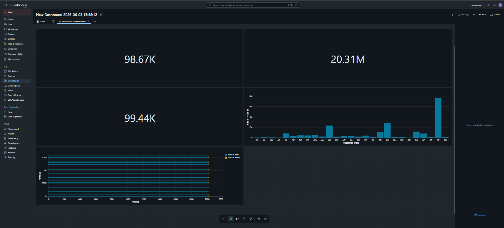

# PySpark Retail Data Warehouse

## Project Overview

This project demonstrates an end-to-end Retail Data Warehouse built using:

- Databricks
- PySpark
- SQL
- Delta Lake
- Databricks Dashboards

The project processes raw e-commerce datasets, creates dimensional and fact tables, performs analytical queries, and visualizes business KPIs through interactive dashboards.

---

## Architecture

Brazilian E-Commerce Dataset (CSV)
↓
PostgreSQL Data Storage
↓
Data Validation & Relationship Checks
↓
PySpark ETL Pipeline (Databricks)
↓
Data Cleaning & Transformation
↓
Star Schema Design
(Fact Sales + Dimension Tables)
↓
Delta Lake Tables
↓
SQL Analytics & KPI Computation
↓
Interactive Databricks Dashboard
↓
Business Insights & Reporting

---

## Technologies & Concepts

### Databases
- PostgreSQL

### Data Processing
- Python
- PySpark
- Databricks

### Data Warehousing
- Star Schema
- Fact & Dimension Modeling
- Delta Lake

### Analytics
- SQL
- KPI Analysis
- Business Insights

### Version Control
- Git
- GitHub

---

## Dataset

Brazilian E-Commerce Public Dataset (Olist)

Tables used:

- Customers
- Orders
- Order Items
- Products
- Sellers
- Payments

---

## Key KPIs

- Total Revenue
- Total Orders
- Total Customers
- Revenue by Seller
- Revenue by Product Category

---

## Project Structure

PySpark-Retail-Data-Warehouse

├── notebooks/
├── sql_queries/
├── dashboard_shots/
├── docs/
└── README.md

---

## Star Schema Design

The project follows a Star Schema model consisting of:

- Fact Table: fact_sales
- Dimension Tables:
  - dim_customer
  - dim_product
  - dim_seller
  - dim_date

See the schema diagram:

docs/star_schema.png

---

## Dashboard Preview

---

## Results

- Total Revenue: 20.31M
- Total Orders: 98.67K
- Total Customers: 99.44K

---

## Future Enhancements

- Incremental ETL pipelines
- Automated scheduling
- Cloud deployment
- Advanced KPI reporting

---

## Author

Seema Patidar
B.Tech + M.Tech (IoT)
Aspiring Data Engineer / Data Analyst
